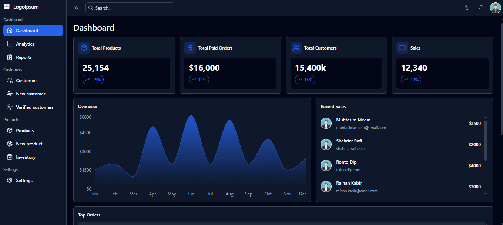

# OrbitDash


## <a name="introduction">💬 Introduction</a>

Welcome to the OrbitDash Dashboard UI Design repository! This project is a responsive Modern Dashboard UI built with React.js, designed for data-driven applications. This project features an intuitive user interface, real-time updates, and customizable widgets for seamless analytics and data visualization.

## 🎯 Live Demo  
🔗 **[Check out the live demo here](https://modern-dashboard-seven.vercel.app/)**  

## <a name="tools">🛠️ Tools</a>

-   [React JS](https://react.dev)
-   [TailwindCSS](https://tailwindcss.com/)
-   [Lucide Icons](https://lucide.dev/)
-   [React Router](https://reactrouter.com/en/main)
-   [Recharts](https://recharts.org/en-US/)

## <a name="features">✨ Features</a>

-   **✅ Responsive Design:** Fully optimized for desktop and mobile devices.
-   **✅ Dynamic Data Visualization:** Supports charts, graphs, and key metrics.
-   **✅ Dark/Light Mode:** Toggle between themes for better usability.
-   **✅ Interactive Widgets:** Customizable dashboard components.
-   **✅ Optimized Performance:** Fast loading with efficient state management.

## <a name="preview">📸 Preview</a>
  
<br>


## <a name="getting-started">🚀 Getting Started</a>

To get started follow these steps:

#### Cloning the Repository

Using CLI

```bash
git clone https://github.com/smRid/Modern-Dashboard.git
```

**\*\*_Ensure you have installed [Git](https://git-scm.com) on your machine._**

or using GitHub:

-   Go to the project [repository](https://github.com/smRid/Modern-Dashboard.git) on my GitHub page
-   Click on the green button on the top 👆
-   Click Download ZIP

#### Installation

Install the project dependencies using npm:

```bash
npm install
```

**\*\*_Ensure you have installed [NodeJS](https://nodejs.org/en) on your machine._**

#### Running the Project

```bash
npm run dev
```

**\*\*_This project uses [Vite](https://vitejs.dev)._**
